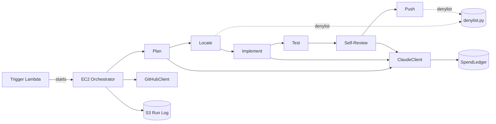
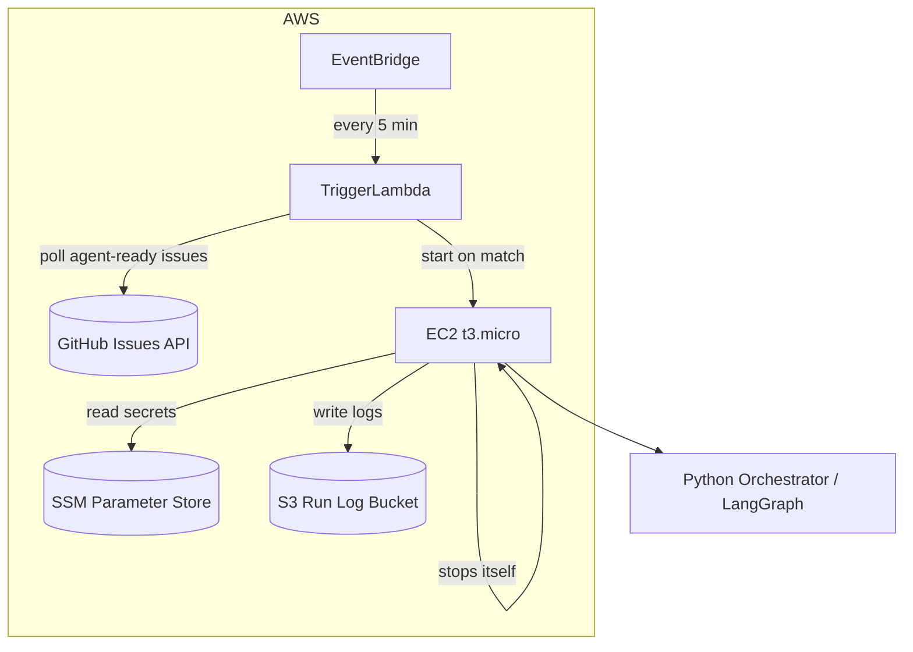

# Architecture Spine — Claude Agentic Graph Engineering Node Workflow

## Design Paradigm

Pipes-and-filters DAG, implemented as a single LangGraph `StateGraph`. One Python orchestrator process per Run; each of the six PRD nodes — Plan, Locate, Implement, Test, Self-Review, Push — is a pure function `RunState -> partial RunState`, composed by LangGraph. Nodes never reach past their return value to mutate shared state directly; the only external side effect any node performs is Implement writing files into the working copy.

## Invariants & Rules



### AD-1 — Single shared RunState, node functions never touch external state directly
- **Binds:** all 6 nodes (FR-2)
- **Prevents:** two nodes independently deciding how to pass data (files on disk vs. in-memory vs. env vars), producing incompatible contracts
- **Rule:** All inter-node data flows through one `RunState` object with fixed field names: `ticket`, `plan`, `file_targets`, `diff`, `test_result`, `review_verdict`, `spend_used`, `run_id`. A node may write to the working copy's files (Implement only) or read GitHub/Claude via the two client wrappers (AD-6); it may not otherwise touch the filesystem, network, or AWS APIs directly.

### AD-2 — Test node always runs against an isolated database
- **Binds:** Test node (FR-2)
- **Prevents:** `php artisan test` hitting the live `self_management_app` MySQL database, since the repo's `.env` defaults to `DB_CONNECTION=mysql` with no testing override committed
- **Rule:** The Test node invokes `php artisan test` with `DB_CONNECTION=sqlite` and `DB_DATABASE=:memory:` forced as process environment variables, regardless of the working copy's `.env`.

### AD-3 — On-demand compute, not always-on
- **Binds:** all 6 nodes, FR-4
- **Prevents:** 24/7 EC2 billing exposure. AWS accounts created after 2025-07-15 no longer get a perpetual EC2 free tier — only $200 in credits for 6 months, then standard rates. `[ASSUMPTION: Joseph's account age unconfirmed — see Deferred]`
- **Rule:** The EC2 instance (t3.micro) starts only when the Trigger Lambda detects a matching Ticket, and the orchestrator stops the instance itself as the last action of every Run (success, failure, or abort) — never left running idle.

### AD-4 — Trigger is a perpetually-free Lambda poll, not a webhook
- **Binds:** FR-1
- **Prevents:** needing a public HTTPS endpoint (API Gateway) or an always-on listener process, and resolves PRD Open Question 1
- **Rule:** An EventBridge schedule invokes a Lambda every 5 minutes (matching FR-1's detection-latency target). The Lambda polls the GitHub Issues API for issues labeled `agent-ready`, and on a match starts the EC2 instance, passing the issue number in.

### AD-5 — Working copy is reset before and after every Run
- **Binds:** all 6 nodes
- **Prevents:** a previous Run's partial diff or uncommitted files leaking into the next Run
- **Rule:** One persistent git clone lives at a fixed path on the EC2 instance. The orchestrator runs `git fetch && git reset --hard origin/main` immediately before Plan starts, and again immediately after Push succeeds or the Run aborts/fails — never left dirty.

### AD-6 — One client wrapper per external system
- **Binds:** all nodes, FR-3
- **Prevents:** retry, auth, and spend-tracking logic being duplicated or forgotten in an individual node
- **Rule:** Exactly one `GitHubClient` (issue read/comment/close, git push) and one `ClaudeClient` (all LLM calls) exist. Nodes call these wrappers only, never the raw `PyGithub`/`anthropic` SDKs. `ClaudeClient` logs token usage to `SpendLedger` on every call, before returning to its caller.

### AD-7 — Denylist is one module, checked twice
- **Binds:** FR-5
- **Prevents:** Locate and Push independently maintaining (and drifting on) two different protected-path lists
- **Rule:** `denylist.py` is the single source of truth for protected paths (`PaymentController.php`, `WebhookController.php`, Cashier/Stripe config, `database/migrations/**`, auth controllers/middleware). Locate checks planned file targets against it; Push re-checks the actual diffed files against the same module immediately before pushing. Either check failing aborts the Run without pushing.

### AD-8 — Spend Cap enforced before every Run starts
- **Binds:** FR-3
- **Prevents:** a Run starting (or continuing) once cumulative Claude spend has reached RM100
- **Rule:** `SpendLedger` is a single append-only JSON file on the instance's persistent disk. The orchestrator sums it at startup and before allowing a new Run; a Run already in progress that would cross the cap is aborted at the next node boundary (not mid-node).

### AD-9 — Run Log always lands in S3, never only on local disk
- **Binds:** Run Log requirement under FR-2
- **Prevents:** losing the audit trail when the on-demand EC2 instance (AD-3) is stopped/replaced
- **Rule:** Every Run writes its full log (plan, diffs, test output, per-node trace, final outcome) to `s3://{run-log-bucket}/runs/{issue-number}/{run-timestamp}/`, in addition to whatever it keeps locally during the Run.

### AD-10 — Secrets via SSM Parameter Store, not Secrets Manager
- **Binds:** all nodes needing GitHub/Claude credentials
- **Prevents:** avoidable AWS cost (Secrets Manager bills per secret; SSM standard SecureString parameters are free tier)
- **Rule:** GitHub PAT and Claude API key are stored as SSM `SecureString` standard parameters and read once at orchestrator startup.

## Consistency Conventions

| Concern | Convention |
| --- | --- |
| State & cross-cutting | All node I/O flows through `RunState` (AD-1); all external calls flow through `GitHubClient`/`ClaudeClient` (AD-6); all spend flows through `SpendLedger` (AD-8) |
| Config & secrets | SSM Parameter Store SecureString only (AD-10); never hardcoded or in plaintext env files on the instance |
| Logging | Every node appends its input/output to the Run Log object for its Run; the same log is mirrored to S3 (AD-9) |

## Stack

| Name | Version |
| --- | --- |
| Python | 3.12 |
| LangGraph | 1.2.x (verified 1.2.1, 2026-05) |
| anthropic (Python SDK) | 1.1.x (verified 1.1.0, 2026-08-26) |
| boto3 | latest at install time (AWS SDK) |
| PyGithub | latest at install time |
| PHP (inherited, unchanged) | ^8.1 |
| Laravel (inherited, unchanged) | ^10.10 |
| phpunit (inherited, unchanged) | ^10.1 |
| AWS EC2 | t3.micro, on-demand (AD-3) |
| AWS Lambda | trigger poll (AD-4) |
| AWS S3 | Run Log storage (AD-9) |
| AWS SSM Parameter Store | secrets (AD-10) |

## Structural Seed



```text
agent-orchestrator/
  orchestrator.py       # LangGraph StateGraph wiring, entrypoint on EC2
  state.py              # RunState schema
  nodes/
    plan.py
    locate.py
    implement.py
    test.py
    self_review.py
    push.py
  clients/
    github_client.py    # single GitHubClient
    claude_client.py    # single ClaudeClient, writes to SpendLedger
  denylist.py            # single protected-path source of truth
  spend_ledger.py         # RM100 cap enforcement
  trigger_lambda/
    handler.py           # EventBridge-invoked poll + EC2 start
```

## Capability → Architecture Map

| Capability / Area | Lives in | Governed by |
| --- | --- | --- |
| FR-1 Ticket detection | `trigger_lambda/handler.py` | AD-4 |
| FR-2 Node graph execution | `orchestrator.py`, `nodes/*` | AD-1, AD-2, AD-5 |
| FR-3 Spend cap | `spend_ledger.py`, `clients/claude_client.py` | AD-6, AD-8 |
| FR-4 Free-tier infra | AWS topology (EC2, Lambda, S3, SSM) | AD-3, AD-4, AD-10 |
| FR-5 Change scope guardrail | `denylist.py`, `nodes/locate.py`, `nodes/push.py` | AD-7 |

## Deferred

- **AWS account tier verification** — AD-3's on-demand design is safe either way, but Joseph should confirm whether his AWS account predates 2025-07-15 (perpetual EC2 free tier) or is newer ($200 credit / 6 months then billed) before relying on any cost projection beyond "on-demand minimizes exposure."
- **Multi-Ticket / concurrency handling** — out of MVP scope per PRD §6.2; this spine assumes one Run at a time and doesn't design for concurrent EC2 starts.
- **Rollback/revert automation** — PRD explicitly defers this (§6.2); no AD here covers undoing a bad push.
- **Exact GitHub Issue → RunState field mapping and Claude prompt design per node** — left to implementation; not an architecture-level invariant since it doesn't cause two builders to diverge structurally.
- **Human-approval gate** — PRD defers this to a possible v2 (§8, Open Question 5); if added later, it inserts as a new node between Self-Review and Push and would need a new AD for where the pause persists state.
